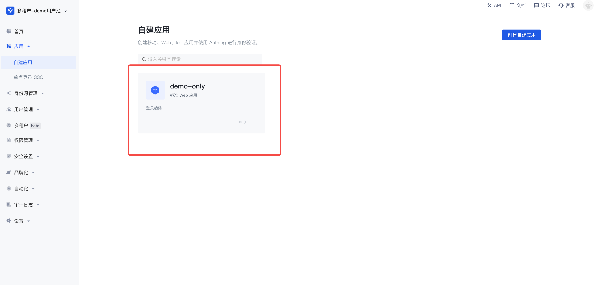

# Authing Multi-Tenant Demo

<div align=center>
  
</div>

<div align=center>
  <a href="https://forum.authing.cn/" target="_blank"></a>
  <a href="https://opensource.org/licenses/MIT" target="_blank"></a>
</div>

**English** | [简体中文](./README.zh-CN.md)

## Introduction

This Demo will show you how to use Authing's Multi-tenant management through a multi -tenant journey.

## 1. Preparation

Login to the Authing Console, select the ToB userpool, and enter the Back-Console.

### 1.1 Prepare an application as Demo application



### 1.2 Prepare a user as a Demo user


## 2. Modify configuration

### 2.1 Modify the front-end configuration

Modify the `/client/CONFIG_ME_FIRST.ts` file, modify the following configuration:

```typescript
// Here is used to configure external source related variable configuration information
export default {
  /** APP ID */
  appId: "<your app id>",
};

```

For more front-end configuration see `/client/.env` environment variables. Generally, special configurations are not required. If special configuration is required, you can create a new copy and store them in the local area.

### 2.2 Modify the back-end configuration

Copy the `/server/.env-example` file and renamed`/server/.env`.

The configuration parameter description is as follows:

|            Name            |        Illustrate          | Whether to configure |
| :------------------------: | :--------------------: | :----------: |
|      DEMO_SERVER_PORT      |     Listening port     |      false      |
|  DEMO_LOGIN_CALLBACK_HOST  |    Log in to complete the callback domain name    |      false      |
| DEMO_FRONTEND_CALLBACK_URL | After the fron-end login is successful, call back the URL |      false      |
|  DEMO_AUTHING_USERPOOL_ID  |       Userpool  ID       |      true      |
|    DEMO_AUTHING_APP_ID     |      APP ID       |      true      |
|  DEMO_AUTHING_APP_SECRET   |    APP Secret     |      true      |
| DEMO_AUTHING_API_ENDPOINT  |  Authing API server address  |      true      |


>**Note:** Application here to log in to adjust URL needs to fill in the address of the back -end of the project's business  <http:localhost:3010/auth/callback>

## 3. Launch project

### 3.1 Started one-click (Recommended)

```sh
// npm （The Install will be automatically executed by default, no additional Install is required）
npm run start

// yarn
// yarn start

// pnpm
// pnpm start

```

### 3.2 Sub-item start

- Front-end

  ```sh
  // Open a terminal
  
  cd client
  pnpm install
  pnpm start
  ```

- Back-end

  ```sh
  // Open another terminal
  
  cd server
  pnpm install
  pnpm start
  ```

### 3.3 Access project

Access <http://localhost:3009>

## License

[MIT](https://opensource.org/licenses/MIT)

Copyright (c) 2023-present, Authing
