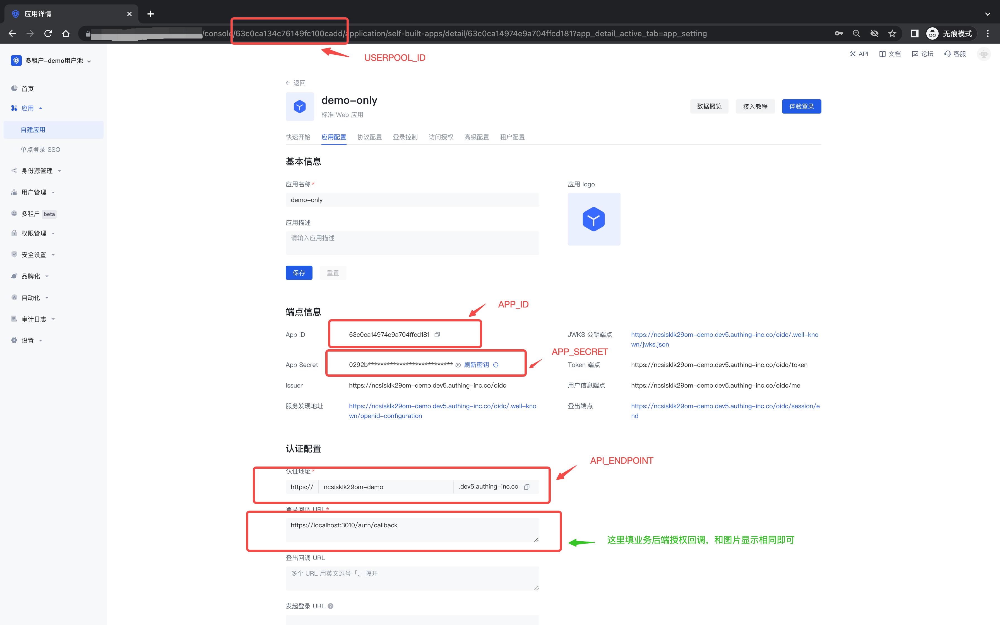

# Authing 多租户 演示示例

<div align=center>
  
</div>

<div align=center>
  <a href="https://forum.authing.cn/" target="_blank"></a>
  <a href="https://opensource.org/licenses/MIT" target="_blank"></a>
</div>

**简体中文** | [English](./README.md)

## 简介

此 Demo 将通过一个多租户旅程来为您演示如何使用 Authing 的多租户管理。

## 1. 准备工作

登录 Authing 控制台，选择 ToB 用户池，进入控制后台。

### 1.1 准备一个应用作为 demo 应用使用


### 1.2 准备一个用户作为 demo 用户使用


## 2. 修改配置

### 2.1 修改前端配置

修改`/client/CONFIG_ME_FIRST.ts`文件，修改如下配置：

```typescript
// 这里用来配置外部来源相关变量配置信息
export default {
  /** 应用 ID */
  appId: "<your app id>",
};

```

前端更多配置见`/client/.env`环境变量，一般不需要特殊配置，如需特殊配置，可以新建副本另存为本地`/client/.env.local`文件。

### 2.2 修改后端配置

复制`/server/.env-example`文件，重命名为`/server/.env`。

配置参数说明如下：

|            名称            |          说明          | 是否必须配置 |
| :------------------------: | :--------------------: | :----------: |
|      DEMO_SERVER_PORT      |        监听端口        |      否      |
|  DEMO_LOGIN_CALLBACK_HOST  |    登录完成回调域名    |      否      |
| DEMO_FRONTEND_CALLBACK_URL | 前端登录成功后回调 URL |      否      |
|  DEMO_AUTHING_USERPOOL_ID  |       用户池 ID        |      是      |
|    DEMO_AUTHING_APP_ID     |      应用 APP ID       |      是      |
|  DEMO_AUTHING_APP_SECRET   |    应用 APP Secret     |      是      |
| DEMO_AUTHING_API_ENDPOINT  |  Authing API 服务地址  |      是      |



>**注意：** 应用这里的登录回调URL 需要填写本项目业务后端授权回调的地址  <http:localhost:3010/auth/callback>

## 3. 启动项目

### 3.1 一键启动(推荐)

```sh
// npm （默认会自动执行 install, 无需额外 install）
npm run start

// yarn
// yarn start

// pnpm
// pnpm start

```

### 3.2 分项目启动

- 前端

  ```sh
  // 打开一个终端
  
  cd client
  pnpm install
  pnpm start
  ```

- 后端

  ```sh
  // 打开另外一个终端
  
  cd server
  pnpm install
  pnpm start
  ```

### 3.3 访问项目

访问 <http://localhost:3009>

## License

[MIT](https://opensource.org/licenses/MIT)

Copyright (c) 2023-present, Authing
